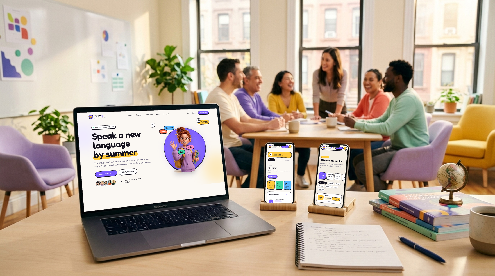
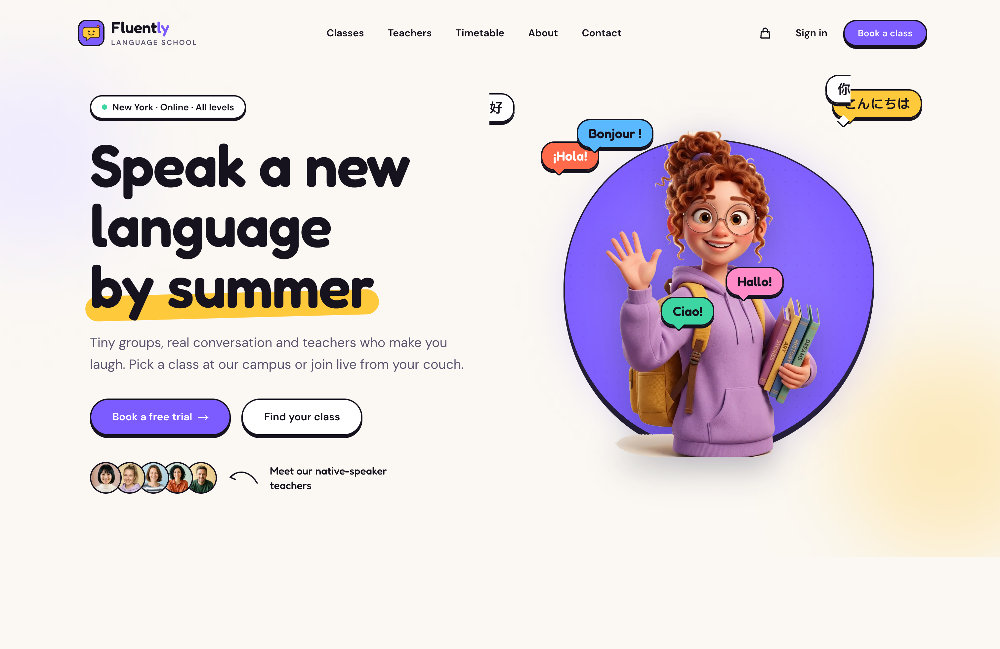
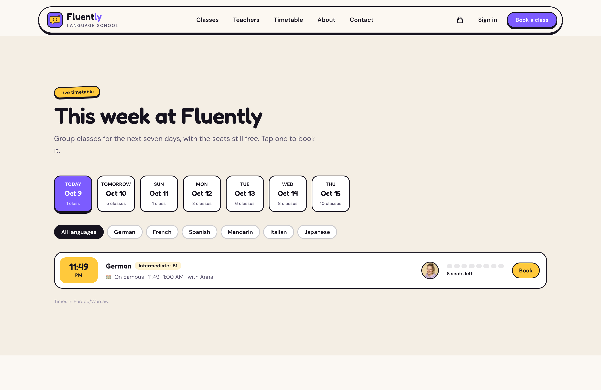
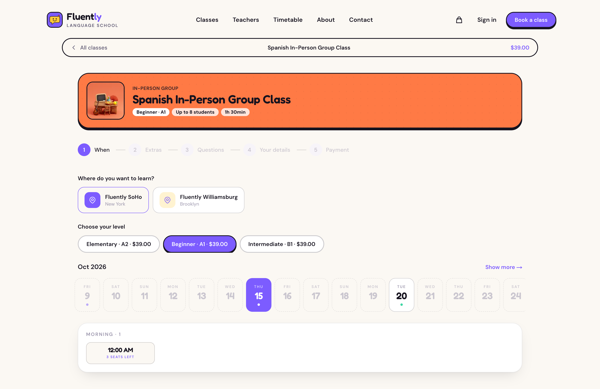
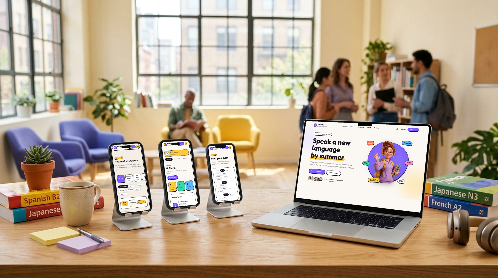

# Fluently — Next.js Language School Booking Template

A production-ready booking website for a language school with campuses and an online classroom. Built with **Next.js 15**, **Tailwind CSS v4**, and the **Opencals Storefront SDK**.

**[View Live Demo →](https://template-fluently.vercel.app)**



Friendly, colorful and playful: a grape-and-sunflower palette, chunky "sticker" buttons, speech-bubble chips and 3D mascots mixed with real photos of teachers and classrooms. Set in **New York** (USD, `America/New_York`) with two campuses (SoHo and Williamsburg) plus a live online classroom, teaching **Spanish, French, German, Italian, Japanese and Mandarin** in group classes, private 1:1 lessons and a free trial. Full storefront included — classes, languages, teachers, timetable, booking, checkout, customer accounts — wired up out of the box. MIT licensed: clone it, rebrand it, ship it.

Nothing about languages is hard-coded. Subjects are your collections, teachers are your staff and class formats are derived from the data, so the same template works for a music, coding, art or tutoring school.

---

## Get Started in 3 Steps

### 1. Create an Opencals account

Sign up at **[app.opencals.com](https://app.opencals.com)** and create a **Dev Store**. When prompted for a dataset, choose the **Fluently** preset (seed dataset `language_school`). It seeds your store with the six languages as collections, campus and online group classes with A1–B1 level variants, private lessons, the free trial and conversation club, the teachers, both campuses and the online classroom (with its meeting link), extras, and the checkout questions, so your template looks exactly like the demo.

### 2. Get your API key

Go to your **User Account Settings** in the Opencals dashboard and generate a **Storefront API key**. You'll need this to connect the template to your store.

### 3. Deploy to Vercel

[](https://vercel.com/new/clone?repository-url=https%3A%2F%2Fgithub.com%2Fletsopencals%2Ftemplate-fluently&env=OPENCALS_API_KEY,AUTH_SECRET&envDescription=API%20key%20from%20your%20Opencals%20dashboard%20and%20a%20random%20secret%20for%20auth&project-name=fluently&repository-name=template-fluently)

During deployment, Vercel will ask you to set environment variables:

| Variable | Value |
|----------|-------|
| `OPENCALS_API_KEY` | Your Storefront API key (starts with `sfk_`) |
| `AUTH_SECRET` | Any random string — used for session encryption |
| `NEXT_PUBLIC_SITE_URL` | Your public URL (drives metadata, sitemap and JSON-LD) |
| `NEXT_PUBLIC_STRIPE_PUBLISHABLE_KEY` | *(optional)* Stripe publishable key for payments |

That's it. Once deployed, you'll have the same fully functional booking site as the [live demo](https://template-fluently.vercel.app).

---

## What's Included

### Home
A big, bubbly hero with a 3D mascot, floating "¡Hola! · Bonjour ! · Ciao!" chips and a stack of real teacher portraits. Below it:
- **Stat tiles** counted from your data (languages, teachers, campuses, group size). Nothing is invented, and zero values are hidden.
- **Pick your language**: one colorful tile per collection.
- A **format switcher**: in-person groups, live online groups or private 1:1.
- **This week at Fluently**: a live timetable of the next seven days of group sessions, with seats left, language filters and one-click booking.
- A teacher strip, a video band and a **level-finder quiz** that recommends a level and links to the free trial.
- How it works, testimonials and the FAQ.





### Classes, Languages & Teachers
- **`/classes`**: the catalog, filtered by language, format and level (shareable URLs: `/classes?language=spanish&format=online&level=A2`). Cards show the level chips, "Up to N students" or 1:1, the duration, campus or online, and the "from" price.
- **`/languages/[slug]`**: a language page in that language's color, with group classes, private lessons, the trial and that language's teachers.
- **`/teachers`** and **`/teachers/[slug]`**: portraits, languages, campuses and online availability, and "Book with {name}", which opens the booking with that teacher preselected.

### Booking
A step-by-step flow (when → teacher → extras → questions → details → payment), with a class header that shows the format, level and seats. Choose **online or campus**, pick a level or length, and see **"N seats left"** on group sessions. Timetable rows and level chips deep-link straight in:

```
/booking/<variant-slug>?date=2026-11-03&staff=<teacher-id>&location=<location-id>
```

The free trial is a $0 class and books without a card. Paid classes use Stripe Elements, with a pay-at-the-school fallback.



### Student Accounts
Passwordless sign-in by default: students enter their email and receive a 6-digit login code (password sign-in stays available). The account shows upcoming and past lessons, the teacher, campus or online classroom, and a **Join lesson** button for online lessons that switches on 15 minutes before the start. Students can reschedule or cancel within the class policy and browse receipts. The confirmation page exports the booked lessons to their calendar (`.ics`).

One-time email links from Opencals (view/reschedule/cancel, leave feedback, verify email, reset password) all resolve through the `/link/[token]` route, which signs the student in and redirects them to the right place.



> **Set your Storefront Base URL.** For emailed links to point back to this app, set **Storefront Base URL** in your Opencals dashboard (Settings → API) to your deployed URL (e.g. `https://your-domain.com`). Opencals builds every customer link as `{storefrontBaseUrl}/link/{token}`.

### SEO Ready
Per-page metadata, Open Graph cards, `LanguageSchool` and `FAQPage` structured data, robots.txt and a sitemap with every language, teacher and class.

---

## The School Model

Fluently uses existing Opencals features only. If you build your own school site, this is the pattern:

- **Subjects are collections.** Each visible collection is a subject (a language here). The special `start-here` collection (the trial and conversation club) is shown as "Try it first" instead.
- **Classes are products; levels are variants.** A group class is one product with `maxAttendees > 1` and one variant per level ("Beginner · A1", "Elementary · A2", …). A private lesson is a 1-seat product with one variant per length. A $0 1-seat product is a free trial.
- **Format comes from locations.** A group class whose locations are all `ONLINE` is an online group; otherwise it's on campus. Private lessons can be offered at both.
- **Teachers are staff.** Assign each class its teachers (`staffIds`); the template works out each teacher's languages, campuses and online availability from those assignments. Group capacity and "seats left" come from `maxAttendees` and live availability.
- **The online classroom is a location link.** Set the meeting URL as the Online location's link. It's shown to the student on the booked lesson and powers the Join button.
- **Colors come from the dashboard.** Each product's color picks its swatch, so a new language gets its own color without code changes.

---

## Tech Stack

| Category | Technology |
|----------|-----------|
| Framework | Next.js 15 (App Router) |
| Styling | Tailwind CSS v4 |
| Fonts | next/font: Fredoka, DM Sans |
| Animations | Framer Motion |
| Data | SWR (client) + React Server Components |
| Forms | react-hook-form + Zod |
| Payments | Stripe Elements |
| Auth | NextAuth.js v5 |
| Dates | moment-timezone |
| API | Opencals Storefront SDK (v0.3.14) |

---

## Local Development

```bash
git clone https://github.com/letsopencals/template-fluently.git
cd template-fluently
npm install
cp .env.example .env.local
```

Edit `.env.local` with your values:

```
OPENCALS_API_KEY=sfk_your_key_here
AUTH_SECRET=change_me_to_a_random_string
```

```bash
npm run dev
```

Open [http://localhost:3000](http://localhost:3000).

> If your API key has **allowed origins** set, server-side requests (which send no `Origin` header) are rejected. Leave the allowlist empty for a key used by this server-rendered template.

---

## Customization

### Branding & Content

All copy is centralized in **`lib/site-config.ts`**: name, tagline, hero, format descriptions, the level quiz, how-it-works steps, testimonials, FAQ and values. Everything bookable (classes, levels, prices, teachers, campuses, availability, extras, logo and banner) comes from your Opencals store.

### Theme Colors

Design tokens live in **`app/globals.css`** as Tailwind v4 `@theme` properties. Token names are stable across the Opencals templates:

```css
@theme {
  --color-bg: #FBF8F3;        /* warm paper */
  --color-ink: #16131F;       /* ink + outlines */
  --color-primary: #7C5CFF;   /* grape */
  --color-sun: #FFC93C;       /* sunflower accent */
  --color-coral: #FF6B4A;
  --color-mint: #3DD6A3;
  --color-sky: #5AB8FF;
  --color-bubblegum: #FF8AC7;
}
```

Per-class colors map from the dashboard color in `lib/subject-color.ts`.

### Imagery

Every image renders through `SafeImage`, so a missing file falls back to the class color instead of a broken box. **Class images, teacher portraits, the logo and banner come from your Opencals store.** Only decorative brand art ships in `public/`: the 3D mascots, the how-it-works props, the About-page photo gallery and `videos/hero.mp4`.

---

## Project Structure

```
app/
  page.tsx                     # Home
  classes/                     # Catalog with filters
  languages/[slug]/            # Subject (collection) pages
  teachers/                    # Teacher list + profiles
  booking/[slug]/              # Booking flow (deep-linkable)
  thank-you/                   # Confirmation + calendar export
  about/ contact/
  account/                     # Student dashboard
  auth/                        # Sign in, sign up, password reset
  link/[token]/                # One-time email link resolver
  api/                         # API routes proxy SDK calls server-side

components/
  home/                        # Hero, stat tiles, timetable, quiz, ...
  classes/ languages/ teachers/ about/
  booking/                     # Booking steps, selectors, summary
  account/                     # Account pages, lesson and order detail
  motion/                      # Reveal, count-up, page transitions
  ui/                          # Shared primitives (button, input, safe-image, ...)

hooks/                         # use-booking-flow, use-availability, use-hydrated, ...
lib/                           # site-config, catalog (subject/teacher/format model), server-data, opencals, auth
```

## Environment Variables

| Variable | Required | Description |
|----------|----------|-------------|
| `OPENCALS_API_KEY` | Yes | Storefront API key from your Opencals dashboard |
| `AUTH_SECRET` | Yes | Random string for NextAuth session encryption |
| `NEXT_PUBLIC_SITE_URL` | Recommended | Public site URL for metadata, sitemap and JSON-LD |
| `NEXT_PUBLIC_STRIPE_PUBLISHABLE_KEY` | No | Stripe publishable key for payment processing |
| `OPENCALS_API_URL` | No | Override API base URL (defaults to production) |

---

## Other Templates

Fluently is one of the open-source booking templates built on the Opencals Storefront SDK. Same backend, different design and vertical:

- **[Clear Care](https://github.com/letsopencals/template-clarity)** — a medical clinic template with department-first booking. [Live demo](https://template-clarity.vercel.app)
- **[Frisor](https://github.com/letsopencals/template-frisor)** — a modern barbershop template with a dark editorial palette. [Live demo](https://template-frisor-sage.vercel.app)
- **[HAAR](https://github.com/letsopencals/template-haar)** — a hair-salon booking template with a light, warm palette. [Live demo](https://template-haar.vercel.app)
- **[VOLT](https://github.com/letsopencals/template-volt)** — a padel & squash club template with a court booking grid. [Live demo](https://template-volt.vercel.app)
- **[NOIR Drive](https://github.com/letsopencals/template-noir)** — a luxury car-rental template with multi-day booking. [Live demo](https://template-noir.vercel.app)

See all templates and the Storefront API at **[opencals.com/developers](https://opencals.com/developers)**.

## Build with AI

Prefer to let an AI agent do the heavy lifting? Install the **[Opencals Agent Skills](https://github.com/letsopencals/skills)** in Claude Code, Cursor, Codex or Gemini CLI:

- **`opencals-build-booking-site`** — scaffold, wire and deploy a template like this one (see `references/classes-and-lessons.md` for the school pattern)
- **`opencals-storefront-api`** — ground-truth reference for the Opencals API & SDK

Docs: **[opencals.com/docs → AI Agents](https://opencals.com/docs/ai-agents/overview)**.

## License

MIT
